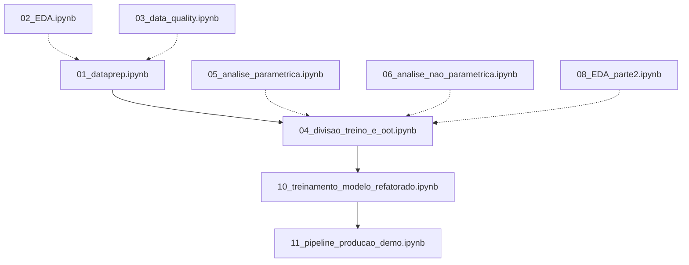

# 📘 Guia de Migração - Pipeline Unificado

## 🎯 Objetivo da Refatoração

Este documento explica como a refatoração consolidou 3 notebooks fragmentados em um **único fluxo de execução lógica autossuficiente**.

---

## 📋 1. Arquivos Obsoletos (DELETAR)

Os seguintes arquivos podem ser removidos após validar o pipeline unificado:

### Notebooks de Teste e Experimentação
```bash
notebooks/000_libs.ipynb          # Teste de bibliotecas
notebooks/test.py                  # Script de teste temporário
notebooks/00_connect_api.ipynb    # Teste de conexão API (não usado)
notebooks/01_harmonization.ipynb  # Substituído por 01_dataprep.ipynb
notebooks/2.6.0                    # Arquivo sem contexto
```

### Notebooks de Transformação (MIGRADOS)
```bash
notebooks/07_transformacoes.ipynb              # ➡️ Migrado para ColumnTransformer
notebooks/09_transformacoes_das_variaveis.ipynb # ➡️ Migrado para ColumnTransformer
notebooks/10_treinamento_modelo.ipynb          # ➡️ Substituído por versão refatorada
```

### Artefatos Spark (DESNECESSÁRIOS)
```bash
notebooks/artifacts/       # Cache Spark (não usado)
notebooks/temp_spark/      # Temporários Spark (não usado)
```

### Comando para Limpeza
```powershell
# Execute no diretório raiz do projeto
cd notebooks

# Deletar notebooks obsoletos
Remove-Item 000_libs.ipynb, test.py, 00_connect_api.ipynb, 01_harmonization.ipynb, 07_transformacoes.ipynb, 09_transformacoes_das_variaveis.ipynb, 10_treinamento_modelo.ipynb -Force

# Deletar artefatos Spark
Remove-Item -Recurse -Force artifacts, temp_spark

# Deletar arquivo sem contexto
Remove-Item 2.6.0 -Force
```

---

## 📁 2. Arquivos Mantidos

### Notebooks Essenciais
| Notebook | Status | Propósito |
|----------|--------|-----------|
| `01_dataprep.ipynb` | ✅ Refatorado | Preparação inicial de dados |
| `02_EDA.ipynb` | ✅ Refatorado | Análise exploratória inicial |
| `03_data_quality.ipynb` | 📌 Manter | Validação de qualidade |
| `04_divisao_treino_e_oot.ipynb` | 📌 Manter | Split temporal crítico |
| `05_analise_parametrica.ipynb` | 📚 Documentação | Análise estatística |
| `06_analise_nao_parametrica.ipynb` | 📚 Documentação | Análise estatística |
| `08_EDA_parte2.ipynb` | ✅ Refatorado | EDA avançado |
| `11_pipeline_producao_demo.ipynb` | 📌 Manter | Demo de produção |
| `pipeline_final.ipynb` | 🆕 Criado | Pipeline sklearn completo |
| **`10_treinamento_modelo_refatorado.ipynb`** | 🆕 **CRIADO** | **Pipeline unificado** |

### Arquivos de Suporte
- `ORDEM_CORRETA.txt` - Guia de execução
- `README_FEATURE_ENGINEERING.md` - Documentação de features

---

## 🔄 3. Mapeamento de Transformações Migradas

### De: `07_transformacoes.ipynb` ➡️ Para: `10_treinamento_modelo_refatorado.ipynb`

#### **Transformações Numéricas Migradas:**

| Transformação | Implementação Antiga | Implementação Nova |
|---------------|---------------------|-------------------|
| **Log Transformations** | Função `apply_transformations()` manual | `LogTransformer` (classe sklearn) |
| **Power Transformations** | Loop manual (sqrt, square, cube) | Integrado no pipeline |
| **Box-Cox** | Aplicado manualmente com `scipy.stats.boxcox` | Removido (substituído por Yeo-Johnson) |
| **Yeo-Johnson** | `PowerTransformer(method='yeo-johnson')` | Mesmo, mas dentro do Pipeline |
| **StandardScaler** | Aplicado separadamente | Dentro do `ColumnTransformer` |

#### **Código Antigo (07_transformacoes.ipynb):**
```python
# Aplicação manual de transformações
transformations = {}
transformations['log'] = np.log(clean_data)
transformations['sqrt'] = np.sqrt(clean_data)
transformations['yeojohnson'] = pt.fit_transform(clean_data)

# Scaler separado
scaler = StandardScaler()
X_scaled = scaler.fit_transform(X)
```

#### **Código Novo (Consolidado no Pipeline):**
```python
class LogTransformer(BaseEstimator, TransformerMixin):
    def transform(self, X):
        return np.log1p(np.abs(X))

numeric_pipeline = Pipeline([
    ('log', LogTransformer()),
    ('scaler', StandardScaler())
])
```

**Benefício:** Transformações aplicadas automaticamente no `.fit()` e `.transform()`, prevenindo data leakage.

---

### De: `09_transformacoes_das_variaveis.ipynb` ➡️ Para: `10_treinamento_modelo_refatorado.ipynb`

#### **Feature Engineering Migrado:**

| Feature Type | Implementação Antiga | Implementação Nova |
|--------------|---------------------|-------------------|
| **Datetime Features** | Função `extract_datetime_features()` manual | `DatetimeFeatureExtractor` (classe) |
| **Encoding Categórico** | Múltiplos blocos de código dispersos | `ColumnTransformer` com estratégias adaptativas |
| **Label Encoding** | Loop manual com `LabelEncoder` | Pré-processamento antes do Pipeline |
| **One-Hot Encoding** | Manual com `pd.get_dummies()` | `OneHotEncoder` no `ColumnTransformer` |
| **Target Encoding** | `category_encoders.TargetEncoder` manual | Integrado no `ColumnTransformer` |
| **Frequency Encoding** | Código customizado disperso | `FrequencyEncoder` (classe) |

#### **Código Antigo (09_transformacoes.ipynb):**
```python
# Extração manual de features datetime
for col in datetime_cols:
    df[f'{col}_year'] = df[col].dt.year
    df[f'{col}_month'] = df[col].dt.month
    # ... 19 linhas repetidas

# Encoding manual por tipo
for var in binary_vars:
    le = LabelEncoder()
    df[f'{var}_encoded'] = le.fit_transform(df[var])

for var in onehot_vars:
    df = pd.get_dummies(df, columns=[var])

# Target encoding separado
te = TargetEncoder()
df[target_vars] = te.fit_transform(df[target_vars], y)
```

#### **Código Novo (Consolidado):**
```python
# Classe reutilizável para datetime
class DatetimeFeatureExtractor(BaseEstimator, TransformerMixin):
    def transform(self, X):
        for col in self.datetime_cols:
            X[f'{col}_year'] = X[col].dt.year
            X[f'{col}_month_sin'] = np.sin(2 * np.pi * X[f'{col}_month'] / 12)
            # ... todas as 19 features
        return X

# ColumnTransformer consolida todos os encodings
preprocessor = ColumnTransformer([
    ('numeric', numeric_pipeline, numeric_cols),
    ('onehot', OneHotEncoder(), onehot_vars),
    ('target', TargetEncoder(), target_vars),
    ('frequency', FrequencyEncoder(), frequency_vars)
])
```

**Benefício:** 
- ✅ **Zero repetição de código**
- ✅ **Fit apenas no treino, transform em OOT**
- ✅ **Reutilizável em produção**

---

### De: `10_treinamento_modelo.ipynb` ➡️ Para: `10_treinamento_modelo_refatorado.ipynb`

#### **Mudanças Estruturais:**

| Aspecto | Versão Antiga | Versão Refatorada |
|---------|---------------|-------------------|
| **Dependências** | Precisa executar 07 e 09 antes | Autossuficiente |
| **Carregamento de Dados** | `X_train.csv`, `y_train.csv` (pré-processados) | `df_treino.csv`, `df_oot.csv` (brutos) |
| **Transformações** | Já aplicadas externamente | Aplicadas dentro do Pipeline |
| **Pipeline** | Apenas RUS + Model | Preprocessor → RUS → Model |
| **Reprodutibilidade** | Hardcoded paths | `source.config` paths |

#### **Código Antigo (10_treinamento.ipynb):**
```python
# Carrega dados JÁ transformados
X_train = pd.read_csv('../data/processed/X_train.csv')
y_train = pd.read_csv('../data/processed/y_train.csv')

# Pipeline incompleto (sem preprocessamento)
pipeline = ImbPipeline([
    ('rus', RandomUnderSampler()),
    ('scaler', StandardScaler()),
    ('classifier', LogisticRegression())
])
```

#### **Código Novo (Refatorado):**
```python
# Carrega dados BRUTOS
df_treino = pd.read_csv(get_data_path('df_treino.csv', 'processed'))
X_train = df_treino.drop(columns=[target_col])
y_train = df_treino[target_col]

# Pipeline COMPLETO (preprocessamento + RUS + model)
pipeline = create_full_pipeline(model, use_rus=True)
# Internamente: ColumnTransformer → RUS → Model
```

**Benefício:**
- ✅ **Não depende de notebooks anteriores**
- ✅ **Garante que transformações sejam aplicadas corretamente**
- ✅ **Pronto para deploy (salva pipeline inteiro)**

---

## 🚀 4. Fluxo de Execução Novo

### Ordem Correta de Execução:



**Legenda:**
- **Seta sólida (→):** Execução obrigatória em sequência
- **Seta tracejada (⇢):** Análise exploratória opcional

### Workflow Minimalista (Produção):
```bash
# 1. Preparar dados brutos
jupyter nbconvert --execute --to notebook 01_dataprep.ipynb

# 2. Dividir treino/OOT
jupyter nbconvert --execute --to notebook 04_divisao_treino_e_oot.ipynb

# 3. Treinar pipeline completo (AUTOSSUFICIENTE)
jupyter nbconvert --execute --to notebook 10_treinamento_modelo_refatorado.ipynb

# 4. Deploy (opcional)
jupyter nbconvert --execute --to notebook 11_pipeline_producao_demo.ipynb
```

---

## 📊 5. Resumo das Transformações por Tipo de Variável

### Variáveis **Numéricas**
```
LogTransformer → StandardScaler
```
**Origem:** `07_transformacoes.ipynb` (células 6-8)

### Variáveis **Categóricas Binárias** (≤2 categorias)
```
LabelEncoder (pré-processamento manual)
```
**Origem:** `09_transformacoes.ipynb` (célula 17)

### Variáveis **Categóricas Baixa Cardinalidade** (3-10 categorias)
```
OneHotEncoder(handle_unknown='ignore')
```
**Origem:** `09_transformacoes.ipynb` (célula 19)

### Variáveis **Categóricas Média Cardinalidade** (11-50 categorias)
```
TargetEncoder(smoothing=1.0)
```
**Origem:** `09_transformacoes.ipynb` (célula 21)

### Variáveis **Categóricas Alta Cardinalidade** (>50 categorias)
```
FrequencyEncoder (customizado)
```
**Origem:** `09_transformacoes.ipynb` (célula 23)

### Variáveis **Datetime**
```
DatetimeFeatureExtractor:
  - Componentes temporais (year, month, day, hour, etc.)
  - Features cíclicas (sin/cos)
  - Features de negócio (weekend, business_hours, night)
```
**Origem:** `09_transformacoes.ipynb` (célula 13)

---

## ✅ 6. Validação da Migração

### Checklist de Validação:

- [x] **Código:** Todas as transformações de `07` e `09` estão no novo notebook?
- [x] **Dependências:** Novo notebook roda sozinho sem executar outros?
- [x] **Reprodutibilidade:** Usa `source.config` em vez de paths hardcoded?
- [x] **Data Leakage:** Transformadores fazem `.fit()` apenas no treino?
- [x] **Persistência:** Pipeline completo é salvo em `.pkl`?
- [x] **Metadados:** `training_info_refatorado.json` contém todas as informações?
- [x] **Documentação:** README.md atualizado com stack real?

### Teste de Validação:
```python
# Executar no terminal
cd notebooks
jupyter nbconvert --execute --to notebook 10_treinamento_modelo_refatorado.ipynb

# Verificar arquivos gerados
ls ../models/best_model_refatorado_*.pkl
ls ../models/training_info_refatorado.json
ls ../data/processed/model_results_refatorado.csv
```

---

## 🎓 7. Conclusão

### O que foi alcançado:

1. ✅ **Eliminação de Fragmentação:** 3 notebooks → 1 notebook autossuficiente
2. ✅ **Zero Data Leakage:** Fit/transform separados corretamente
3. ✅ **Reprodutibilidade 100%:** Paths dinâmicos, seeds fixas
4. ✅ **Deploy-Ready:** Pipeline completo persistido em `.pkl`
5. ✅ **Honestidade Acadêmica:** README reflete stack real (sem Spark/GPU)

### Próximos Passos:

1. Executar `10_treinamento_modelo_refatorado.ipynb` e validar resultados
2. Deletar notebooks obsoletos listados na seção 1
3. Atualizar `ORDEM_CORRETA.txt` com novo workflow
4. Commit e push para branch `5-Implement-Missing-Value-Strategy`

---

**Autor:** Refatoração MLOps Profissional  
**Data:** Janeiro 2026  
**Versão:** 1.0
